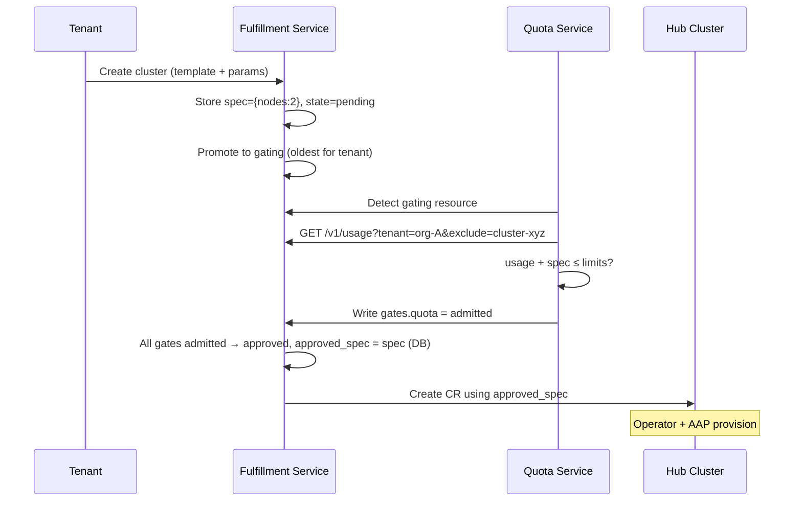

# Quota Management for OSAC
## The Problem

Today, resource provisioning has **no limits**:

```
$ fulfillment-cli create cluster --template ocp_4_17_small   # sure
$ fulfillment-cli create cluster --template ocp_4_17_small   # why not
$ fulfillment-cli create cluster --template ocp_4_17_small   # still going
... (repeat 50 times) ...
```

The only backstop is **ESI running out of physical hardware**.

For a multi-tenant AI cloud platform, that's not a plan.

---

## Architecture — Big Picture

```
                      Fulfillment Service
                      ┌──────────────────────────────────┐
Tenant ──create/──>   │ Stores user intent in spec       │
  (CLI, UI)  scale    │ Manages approval state machine   │
                      │ (pending→gating→approved/rejected)│
                      │                                  │
                      │ On approval:                     │
                      │   approved_spec = spec (internal) │
                      │   Creates CR on hub ──────────────────> Hub Cluster
                      │                                  │     (Operator + AAP)
                      │  ┌────────────┐ ┌────────────┐   │
                      │  │ PostgreSQL │ │ /v1/usage  │   │
                      │  │ resources  │ │ (metering) │   │
                      │  └────────────┘ └────────────┘   │
                      └───────────────┬──────────────────┘
                                      │ gRPC API
                                      │ (reads usage, writes gate decisions)
                      ┌───────────────┴──────────────────┐
                      │       Quota Service              │
                      │                                  │
                      │  Watches for "gating" resources  │
                      │  Reads /v1/usage for tenant      │
                      │  Compares against limits         │
                      │  Writes: gates.quota = admitted  │
                      │          or rejected             │
                      │                                  │
                      │         ┌──────────────────┐     │
                      │         │ PostgreSQL       │     │
                      │         │ quota limits     │     │
                      │         │ (admin/ColdFront)│     │
                      │         └──────────────────┘     │
                      └──────────────────────────────────┘
```

**One config flag**: `OSAC_APPROVAL_REQUIRED` (default: `false` = no quotas)

---

## K8s-Like API Model

Following Kubernetes conventions — `spec` = user intent, `status` = observations:

```yaml
Cluster:
  spec:                               # User's intent (always)
    node_sets: {fc430: {size: 5}}     # What the user wants
  status:
    state: READY                      # Hub-reported (Operator)
    approval:                         # Observations (FS reports)
      state: "rejected"
      gates:
        quota:
          state: "rejected"
          reason: "Would exceed quota by 3 nodes"
```

`spec` = what you want. `status.approval` = what the system decided.
`approved_spec` stays internal to FS database — not in the API.
Tenant usage available via `/v1/usage` endpoint.

---

## Approval States

```
             ┌─────────────────────────────────┐
             │                                 │
   create ──>│ pending ──> gating ──> approved │ ──> running 
   or scale  │    ^         │                  │
             │    │         └──> rejected      │
             │    │                │           │
             │    │         re-evaluation      │
             │    └──────── trigger sets       │
             │              back to pending    │
             └─────────────────────────────────┘
```

- **pending** — waiting in queue
- **gating** — being evaluated (one per tenant at a time — semaphore)
- **approved** — all gates passed, provisioned
- **rejected** — gate rejected, user intent preserved, auto-retried on footprint change
- After TTL: `AdmissibilityExpired` condition (K8s pattern) — tenant can poke to retry

---

## How It Works — Creation



---

## How It Works — Scale

**General rule:**

| Condition | Result |
|-----------|--------|
| `new_spec > approved_spec` | → pending (needs gating) |
| `new_spec ≤ approved_spec` | → approved immediately (freeing resources) |

**Rejection is not terminal:** user's `spec` (intent) is preserved. When quota frees up, rejected resources are set back to pending → re-evaluated automatically.

**Quota formula:**
```
projected = usage_from_endpoint + spec_of_gated_resource
```

Metering (usage computation) and enforcement (quota check) are cleanly separated.

---

## Metering and Quota — Clean Separation

```
Metering layer (Fulfillment Service):
  /v1/usage?tenant=org-A
  → {clusters: 2, nodes.h100: 8, nodes.fc430: 6}

  Standalone capability. Usable by:
  - Quota Service (enforcement)
  - CLI / UI (tenant visibility)
  - Billing (future)
  - Capacity planning (future)

Quota layer (Quota Service):
  usage + gated_resource_spec ≤ limits?
  → admitted or rejected

  Consumes metering data. Doesn't compute usage itself.
```

---

## Key Decisions

| Decision | Rationale |
|----------|-----------|
| **Metering + quota separation** | /v1/usage as standalone metering. QS consumes it. |
| **No ledger** | Metering computed from FS data. No drift. |
| **Gating semaphore** | One resource per tenant evaluated at a time. |
| **Extensible gates** | `gates` map supports quota now, billing/policy later. |
| **K8s-like API** | `spec` = intent, `status` = observations only. |
| **Auto-retry** | Rejected resources re-queued on footprint change. |
| **Backwards compatible** | `OSAC_APPROVAL_REQUIRED=false` (default). |
| **approved_spec in DB only** | Not in API. Status is observational. |

---

## ColdFront Integration (MOC)

MOC uses **ColdFront** to manage resource allocations across all platforms (OpenShift, OpenStack, SLURM). Each platform has a plugin.

**Plan:** Build an OSAC plugin that pushes raw resource limits (`{nodes.h100: 20}`) to the Quota Service API. ColdFront handles the abstraction layer; the Quota Service just sees raw counts.

---

## Open Items

**1. Metering endpoint scope (feedback from Michael)**
- Michael suggests metering should be designed as a prerequisite for quotas
- Our proposal: ship /v1/usage endpoint alongside Quota Service in v1
- Awaiting his response on whether this layering is sufficient

**2. Template parameter overrides (feedback from Lars)**
- `spec.node_sets` already populated by FS at creation time
- Edge case: `worker_count` template param bypasses `spec.node_sets`
- Fix: Ansible should read from nodeRequests, retire `worker_count`

**3. Queuing strategy (implementation phase)**
- FIFO, HOL blocking, backfilling — defer to implementation
- Kueue's BestEffortFIFO recommended as default pattern

**4. GPU tracking** — prerequisite: add structured `gpus` field to ComputeInstanceSpec

---

## What's in the Proposal (but not in this talk)

Read the PR for:
- Security model and prerequisites (field-level write protection, cross-tenant access)
- Migration / upgrade / downgrade strategy
- Observability (Prometheus metrics, alerts, audit logging)
- Reconciler logic (3-step, hub status sync)
- Organizations / Gateway integration path

---

## Links

**Proposal PR:** github.com/osac-project/enhancement-proposals/pull/28

**Jira Epic:** MGMT-23368 (9 tasks)
