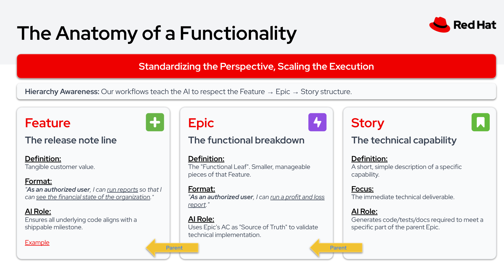

<style>
section.compact { font-size: 22px; }
section.compact li { margin-bottom: 2px; }
section.compact h2 { margin-bottom: 10px; }
section.flow code { font-size: 0.75em; background: none; padding: 0; }
section.flow { font-size: 24px; }
</style>

<!-- _class: title -->
<!-- _paginate: false -->

# AI-Assisted SDLC

### From Jira Feature to merged PR — powered by Claude Code skills

---

## Agenda

1. The OSAC workspace setup
2. The Jira hierarchy: Feature → Epic → Story
3. Creating a Feature in Jira
4. The SDLC workflow: PRD → Design → Implement
5. Consistent phase structure across workflows
6. Real examples: PRD and Design PRs
7. Demo
8. Dev environment: /osac-cluster

---

<!-- _class: divider -->

# The OSAC Workspace

---

## osac-workspace

The mono-repo meta-workspace that ties everything together.

```text
osac-workspace/
├── AGENTS.md / CLAUDE.md  # Project context, rules, conventions
├── bootstrap.sh           # Installs skills, clones/fetches repos
├── AI-assisted-development-workflow.md
├── .design/context/       # Feature dimensions, review patterns
├── fulfillment-service/   # gRPC server + REST gateway
├── osac-operator/         # Kubernetes operator
├── osac-aap/              # Ansible roles
├── osac-ui/               # Web console
├── enhancement-proposals/ # PRDs and design docs
└── ...                    # other component repos
```

---

## bootstrap.sh

Run once at the start of each session to stay current.

- **Clones** all component repos (or `git fetch` if already present)
- **Installs/updates AI workflow skills** from [flightctl/ai-workflows](https://github.com/flightctl/ai-workflows)
- **Sets up fork remotes** for the PR workflow

```bash
cd osac-workspace
./bootstrap.sh
```

After bootstrap, every skill (`/prd`, `/design`, `/implement`, `/e2e`) is available and the codebase is up to date.

---

## The OSAC Harness

**AGENTS.md** — the **primary** instruction file, tool-agnostic:

- Repo structure, build commands, test commands
- Architecture patterns and coding conventions
- Works with any AI coding tool (Claude Code, Copilot, Codex, Gemini)

**CLAUDE.md** — references AGENTS.md, adds Claude-specific hooks and shortcuts.

Every OSAC repo gets an AGENTS.md. Migration in progress — some still use CLAUDE.md only.

**Supporting files in osac-workspace:**

- `AI-assisted-development-workflow.md` — the step-by-step SDLC guide
- `.design/templates/` — PRD and EP templates used by `/prd:draft` and `/design:draft`
- `.design/context/` — feature dimensions and review patterns
- `skills/` — project-specific skills (prd-review, osac-cluster, operate)

---

<!-- _class: divider -->

# The Jira Hierarchy

---

<!-- _paginate: false -->



---

## How It All Connects

```text
  Jira Feature (OSAC-1269)
  │
  ├── PRD (enhancement-proposals PR #74)
  │     └── merged → local copy in repo
  │
  ├── Design / EP (enhancement-proposals PR #60)
  │     ├── merged → local copy in repo
  │     └── /design:decompose → task breakdown
  │
  ├── /design:sync
  │     ├── Epic 1: API changes        (OSAC-1300)
  │     │     ├── Story 1.1             (OSAC-1301)
  │     │     └── Story 1.2             (OSAC-1302)
  │     ├── Epic 2: Operator changes   (OSAC-1310)
  │     │     └── Story 2.1             (OSAC-1311)
  │     └── Epic 3: UI changes         (OSAC-1320)
  │           └── Story 3.1             (OSAC-1321)
  │
  └── /implement per story → code PRs on component repos
```

---

<!-- _class: divider -->

# The SDLC Workflow

---

## A Sequential Process

```text
  ┌─────────────┐     ┌─────────────┐     ┌────────────────┐     ┌─────────────┐
  │             │     │             │     │                │     │             │
  │ Requirements│────▶│   Design    │────▶│ Implementation │────▶│ E2E Testing │
  │             │     │             │     │                │     │             │
  └─────────────┘     └─────────────┘     └────────────────┘     └─────────────┘
     /prd                /design             /implement              /e2e

  Starts with a        Detailed design      Code changes on        Test suite for
  Jira Feature to      plan and epic        a per-story basis      all scenarios
  produce a PRD        breakdown                                   per story
```

Each phase is a **skill** — a collection of sub-phases (commands) built to work together.

---

<!-- _class: divider -->

# Creating a Feature

---

## /osac-feature

Before starting the SDLC workflow, create a Feature in Jira.

```bash
> /osac-feature
```

- Describe what you want to build in natural language
- Claude creates a **Feature** issue in the OSAC Jira project
- The Feature becomes the anchor for everything downstream:
  PRD, Design, Epics, Stories, and code PRs

The Feature is the **release note line** — tangible customer value.

---

<!-- _class: divider -->

# Requirements: /prd

---

<!-- _class: flow -->

## PRD Phases

**`/prd:ingest`** — Fetches the Jira Feature, linked issues, and comments. Explores the codebase for context. Writes `01-requirements.md`.

**`/prd:clarify`** — Asks targeted questions in batches of 3-5. Tracks answers in `02-clarifications.md`. Stops when exit criteria are met.

**`/prd:draft`** — Generates PRD using the project template (`templates/prd.md`). Follows `section-guidance.md` for content standards.

**`/prd:revise`** — User reviews and requests changes. PRD updated, consistency maintained. Repeatable.

**`/prd:publish`** — Commits PRD to a feature branch, creates a draft GitHub PR, writes `04-pr-description.md`.

**`/prd:respond`** — Fetches PR review comments, proposes responses (user approves before posting), updates PRD as needed. Repeatable.

---

## PRD: Real Example

**PR #74** — [OSAC-1269: Managed version catalog for cluster provisioning](https://github.com/osac-project/enhancement-proposals/pull/74)

- Started from Jira Feature OSAC-1269
- `/prd:ingest` pulled the feature description and linked issues
- `/prd:clarify` refined scope (15 functional requirements, 6 acceptance criteria)
- `/prd:publish` created the PR for team review
- `/prd:respond` addressed reviewer comments inline

The PRD lives in `enhancement-proposals/enhancements/<feature>/prd.md` — a local copy available to all downstream workflows.

---

<!-- _class: divider -->

# Design: /design

---

<!-- _class: flow -->

## Design Phases

**`/design:ingest`** — Reads the merged PRD, loads feature dimensions and review patterns, explores codebase architecture.

**`/design:research`** — Investigates the problem space: existing implementations, external standards, integration constraints.

**`/design:draft`** — Writes the Enhancement Proposal (EP) using the project template. Covers API changes, component impacts, test plan, upgrade strategy.

**`/design:decompose`** — Breaks the design into Jira-ready **Epics** and **Stories** with acceptance criteria and estimates.

**`/design:revise`** — Iterate on design based on feedback. Repeatable.

**`/design:publish`** — Creates a GitHub PR with the EP document.

**`/design:respond`** — Addresses PR reviewer comments. Repeatable.

**`/design:sync`** — Syncs the approved breakdown to Jira: creates Epics and Stories under the Feature.

---

## Design: Real Example

**PR #60** — [OSAC-1111: StorageBackend API design document](https://github.com/osac-project/enhancement-proposals/pull/60)

- Built on top of the merged PRD (PR #51)
- `/design:research` investigated the NetworkClass pattern to follow
- `/design:draft` produced the full EP with API specs, lifecycle model, and open questions
- `/design:decompose` created epics and stories for implementation
- `/design:publish` submitted for team review
- Reviewers commented on credential handling and Signal RPC decisions

The EP lives in `enhancement-proposals/enhancements/<feature>/design.md`.

---

<!-- _class: divider -->

# Implementation: /implement

---

<!-- _class: flow -->

## Implement Phases

**`/implement:ingest`** — Fetches the Jira story, loads the PRD and design from local copies in `enhancement-proposals/`. Explores the target codebase. Builds a validation profile.

**`/implement:plan`** — Designs the implementation approach with task breakdown and test strategy.

**`/implement:revise`** — Incorporate feedback on the plan. Repeatable.

**`/implement:code`** — TDD cycle: write failing test, implement, refactor. Commits incrementally.

**`/implement:validate`** — Runs full test suite, lint, coverage analysis. Iterates on gaps.

**`/implement:publish`** — Pushes branch to fork, creates a PR with validation results.

**`/implement:respond`** — Addresses PR reviewer comments. Repeatable.

---

## Local Context for Implementation

A key design decision: **PRDs and designs live in the repo**.

```text
enhancement-proposals/
└── enhancements/
    └── storage-backend/
        ├── prd.md          ← requirements
        └── design.md       ← design / EP
```

When `/implement:ingest` runs, it reads these local files directly — no need to re-fetch from Jira or re-derive context.

The AI has full access to:
- **Why** we're building it (PRD)
- **How** we decided to build it (Design)
- **What** specific story to implement (Jira)

---

<!-- _class: divider -->

# Consistent Structure

---

## Uniform Phases Across Workflows

Every workflow follows the same pattern:

| Phase | /prd | /design | /implement | /e2e |
|-------|------|---------|------------|------|
| **ingest** | Jira + codebase | PRD + codebase | Story + PRD + design | Story + codebase |
| **research** | — | Problem space | — | — |
| **clarify** | Q&A | — | — | — |
| **plan** | — | — | Task breakdown | Task breakdown |
| **draft/code** | Write PRD | Write EP | TDD cycle | Write tests |
| **decompose** | — | Epics + Stories | — | — |
| **revise** | Iterate | Iterate | Iterate | Iterate |
| **validate** | — | — | Tests + lint | Tests + lint |
| **publish** | GitHub PR | GitHub PR | GitHub PR | GitHub PR |
| **respond** | PR comments | PR comments | PR comments | PR comments |

---

<!-- _class: divider -->

# Demo

---

## See It In Action

A recorded walkthrough of the full PRD → Design → Implement flow using a real OSAC feature (OSAC-1710: StorageTier Selection).

**[Watch the demo on asciinema](https://asciinema.org/a/Lx1IthC4e3qlEVQ0)**

Shows each phase in sequence:
- `/prd:ingest` pulling from Jira
- `/prd:clarify` with interactive Q&A
- `/prd:publish` creating a GitHub PR
- `/design:ingest` through `/design:sync`
- `/implement:ingest` with local PRD/design context
- `/implement:code` with TDD (red → green → refactor)
- `/implement:publish` with validation and PR creation

---

<!-- _class: divider -->

# Dev Environment: /osac-cluster

---

## From Zero to Running Cluster

The `/osac-cluster` skill uses **cluster-tool** to boot a fully working OSAC development cluster from a snapshot.

```text
Developer laptop  ──SSH──▶  Baremetal server
     │                           │
     │  cluster-tool             │  libvirt VM (OpenShift SNO)
     │  (Python CLI)             │  64 GB RAM, 16 vCPUs
     │                           │
     │  ~/.kube/<name>.kubeconfig│  All OSAC components pre-installed
```

**Two flavors available:**

| Flavor | What's included |
|--------|----------------|
| `vmaas` | OpenShift + LVMS + CNV + Keycloak + AAP + OSAC (VM provisioning) |
| `caas` | OpenShift + LVMS + MetalLB + MCE + Keycloak + AAP + OSAC (cluster provisioning) |

---

## cluster-tool Workflow

```bash
# One-time setup
sudo cluster-tool setup client                     # DNS on laptop
cluster-tool connect myserver --host root@server    # Connect to baremetal

# Pull a flavor (~10-15 min, once per server)
cluster-tool pull quay.io/rh-ee-ovishlit/cluster-flavors:vmaas

# Boot a cluster (~5 min)
cluster-tool boot --flavor vmaas --name dev

# Use it
export KUBECONFIG=~/.kube/dev.kubeconfig
oc get nodes
```

- **Snapshot-based** — each cluster is a copy-on-write clone with unique certs
- **Transactional** — failed boots auto-rollback, no orphaned VMs
- **Parallel** — boot multiple clusters simultaneously
- **Refresh** — update the OSAC stack to latest with `refresh-after-snapshot.py`

---

<!-- _class: title -->
<!-- _paginate: false -->

# Questions?

### Start with `./bootstrap.sh` and try `/prd:ingest <JIRA-KEY>`
